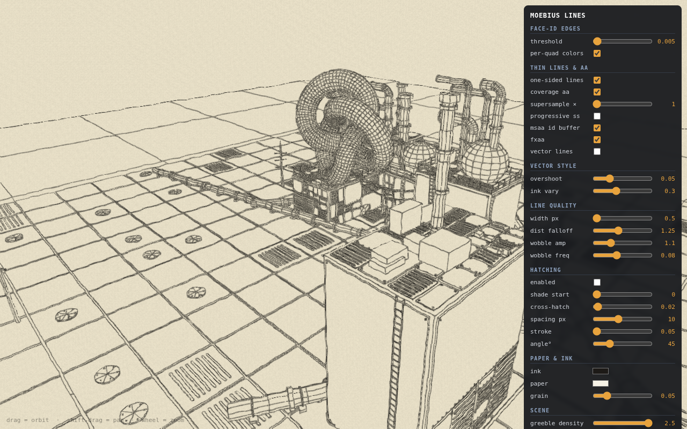

# linework2026

Real-time Moebius / Geof Darrow–style ink linework in the browser. One HTML file, no build step.

## Run it

Open `index.html` in any browser (it pulls Three.js from cdnjs, so it needs internet). Drag to orbit, shift-drag to pan, wheel to zoom. Every parameter is a live slider.

## How it works

### Face-ID edge detection — the whole detector

Instead of the usual depth + normal edge detection, every face in the scene is assigned a **random vertex color** ("face ID"). The scene is rendered once with those colors into an offscreen buffer, and a fullscreen shader draws ink wherever neighboring pixels have different colors. Because every face boundary, silhouette, and object-vs-object overlap produces a color step, this single test catches everything the classic depth/normal channels catch — plus all the interior paneling they miss. Depth and normal edge detection were removed entirely; a depth texture is kept only as *data* (distance falloff and sky masking), never as an edge source.

Faces are colored per quad (consecutive triangle pairs share a color) so quads read as single faces instead of showing their diagonals. Color variation is hierarchical — structural hulls get strong random colors, fine panels weak ones — which turns the detection threshold slider into a free level-of-detail dial: raise it and fine paneling melts away, leaving bold structural lines.

### All detail is geometry

There are no ink textures or drawn details. A procedural greeble system builds everything the lines come from: recursive panel subdivision on every block face, rivets, vent slats, portholes with bolt rings, pipes with flanges and torus elbows, ladders, railings, catenary cables, plated flooring with manholes and grates, antenna masts. All of it is baked into **one merged BufferGeometry — a single draw call** (~106k triangles / ~213k extracted edges at max density).

### Render pipeline (raster mode)

1. **ID pass** — scene rendered as face colors, with a depth texture attached
2. **Normal pass** — only when hatching is enabled
3. **Ink pass** — fullscreen shader: face-ID edge test (optionally one-sided, drawing only on the nearer surface for half-width lines; optionally coverage AA, averaging the test at 4 sub-pixel offsets), hand-drawn wobble via noise-perturbed sampling UVs, distance-based line thinning that fades distant ink entirely past falloff 1.0, optional screen-space cross-hatching from N·L, paper grain
4. **Blit** — optional FXAA, and filtered downsampling when supersampling is on

Anti-aliasing options stack: one-sided lines, coverage AA, MSAA on the ID buffer, FXAA, and 1–2× supersampling with **progressive refinement** (interactive frames render at 1×; a full supersampled frame snaps in ~250ms after you stop moving). A dirty-flag loop skips rendering entirely when nothing changes.

### Vector line mode

A second, fully separate renderer: at build time every quad boundary is extracted as real line geometry (the duplicated diagonal vertices of each triangle pair identify which edge to drop), then the scene renders as a paper-colored occluder (polygon offset) with the edge lines drawn on top — classic hidden-line rendering, perfectly crisp at any zoom. The lines get their hand-drawn character from a custom shader: world-space noise wobble in the vertex stage (stable while orbiting), per-edge seeds so duplicated shared edges read as natural double-strokes, randomized endpoint overshoot, per-stroke ink variation, and distance-based opacity fade.

## Controls

Everything is on sliders in the panel: detection threshold, per-quad coloring, the five AA toggles, line width and distance falloff, wobble amplitude/frequency, hatching (thresholds, spacing, angle), ink/paper colors and grain, vector-mode overshoot and ink variation, and greeble density (rebuilds the scene). `export png` saves the current frame.

## Tech

Three.js (r160) + WebGL2, custom GLSL throughout. No dependencies beyond Three.js, no build step, no frameworks. Orbit controls and the UI panel are hand-rolled.
